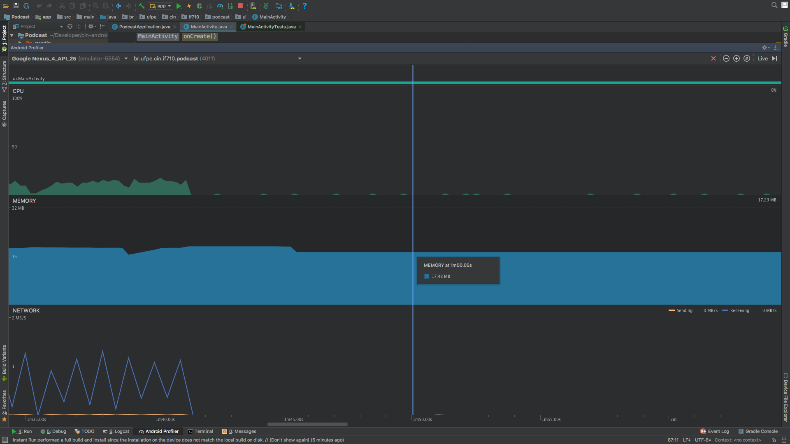

# Consumo de Rede

Para testar o consumo de rede utilizamos o **AndroidProfiler**. Particularmente medimos os seguintes intervalos:

* Download do feed
* Início do download do podcast
* Final do download do podcast

* Download do feed

* Início de download do podcast

* Final do download do podcast

Como podemos ver, a consumo de rede dá um pico nesses momentos, alternando entre momentos de altos e baixos, os quais acreditamos ser os diversos streams de dados recebidos.

Como medidas para reduzir o consumo de rede, utilizamos o header **Accept-Encoding** para requisitar os pacotes compactados no formato **gzip**:

Além disso, criamos um JobService para só atualizar a lista de feed a cada 30 minutos. Desta forma, baixamos o feed uma vez assim que a MainActivity é criada, e depois de só quando o JobService disparar um serviço para o novo download. Vale lembrar que a partir do Android Nougat (API 25) o período mínimo para agendamento é de 15 minutos.

