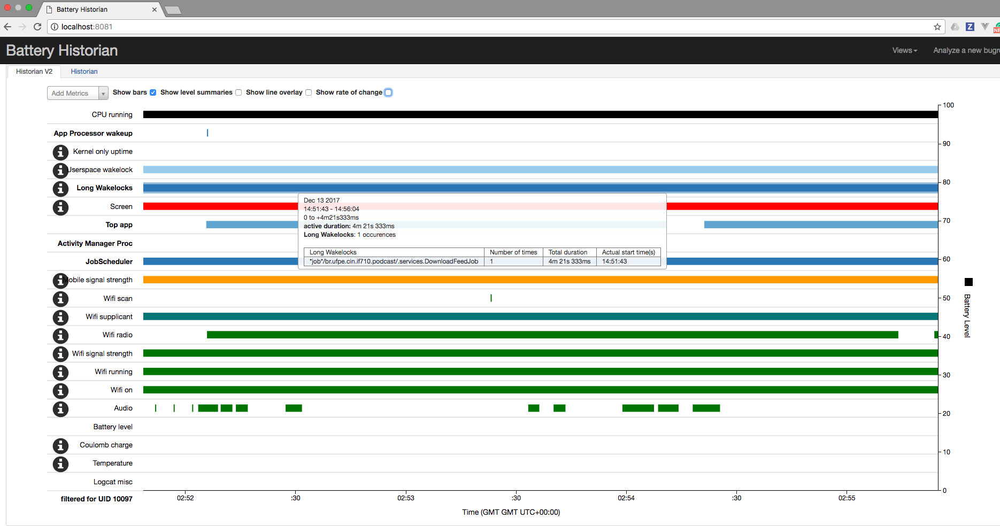
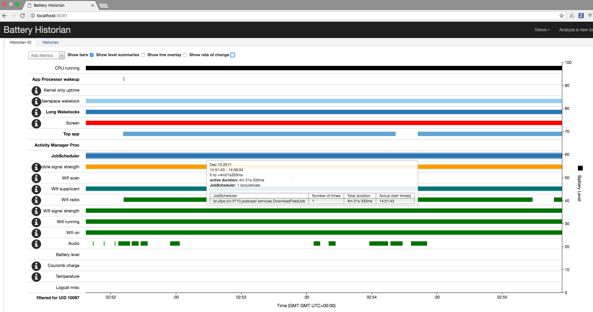
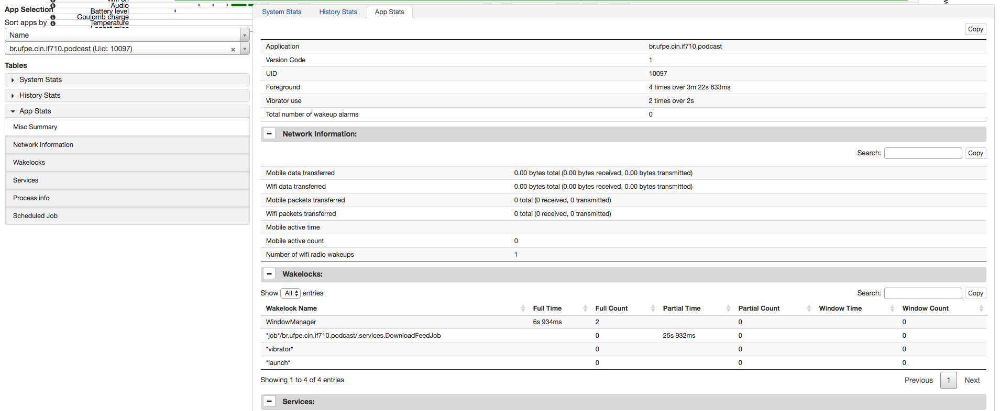
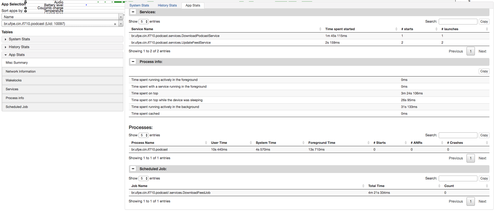

# Battery

De forma resumida, podemos afirmar que não é trivial medir o consumo de bateria por aplicativo. O que fazemos na prática é checar quais componentes estão habilitados em cada instante. Para isto usamos o BatteryStats para logar os registros, juntamente com o BatteryHistorian para visualizar os arquivos de log.

Segue as imagens:

Como medidas para reduzir o consumo de bateria, podemos citar o acesso ao banco de forma esporádica, sempre com inserção em batch (menos acessos ao disco), o mesmo acontecendo com o download do feed. O reuso dos elementos da listView faz com que se consuma menos memória (120mA por acesso) e consequentemente menos bateria.
