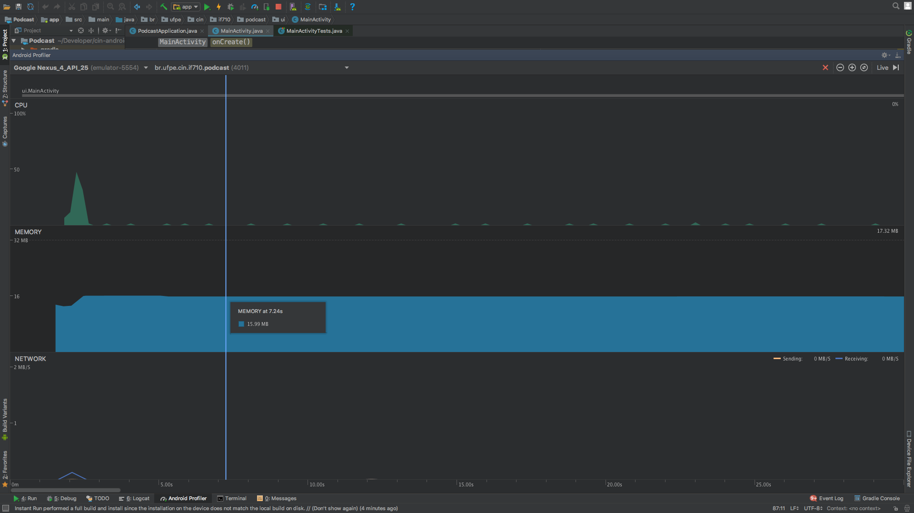
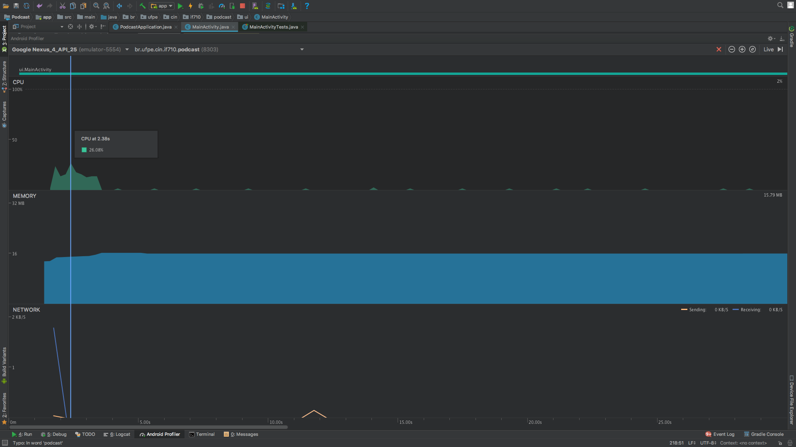
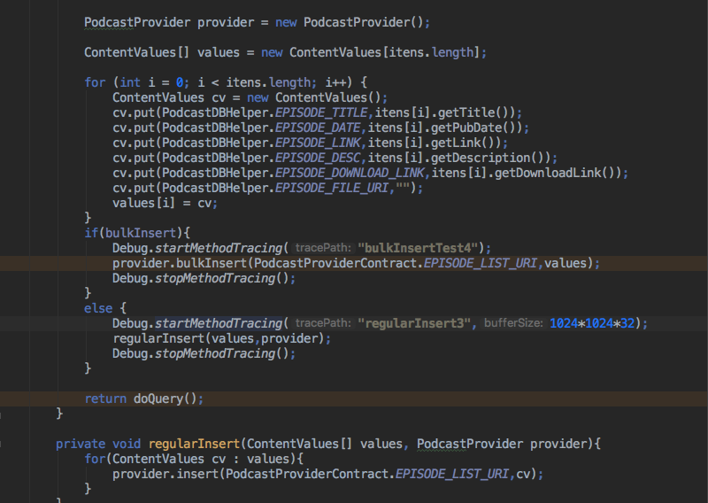
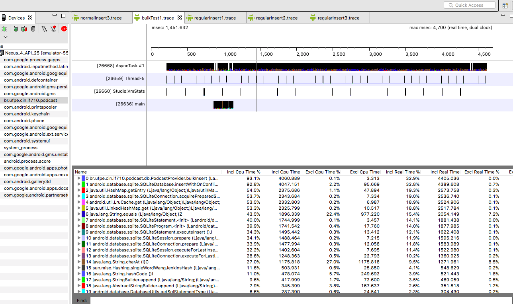
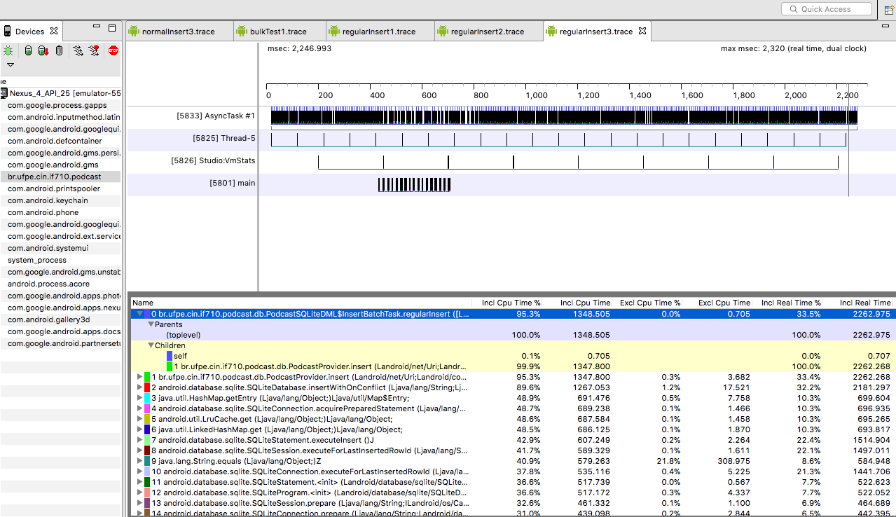
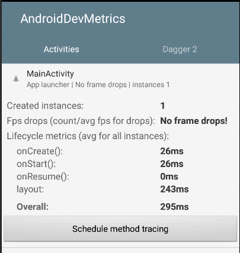
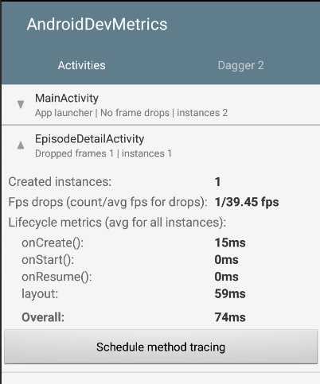
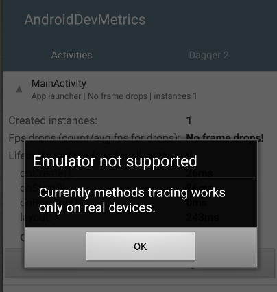
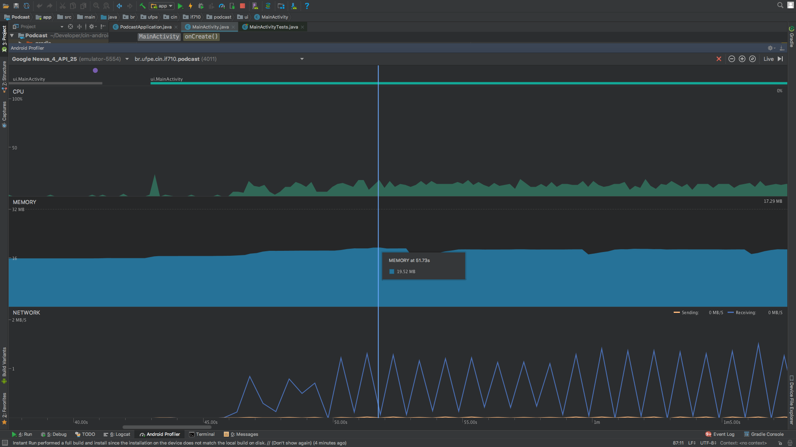
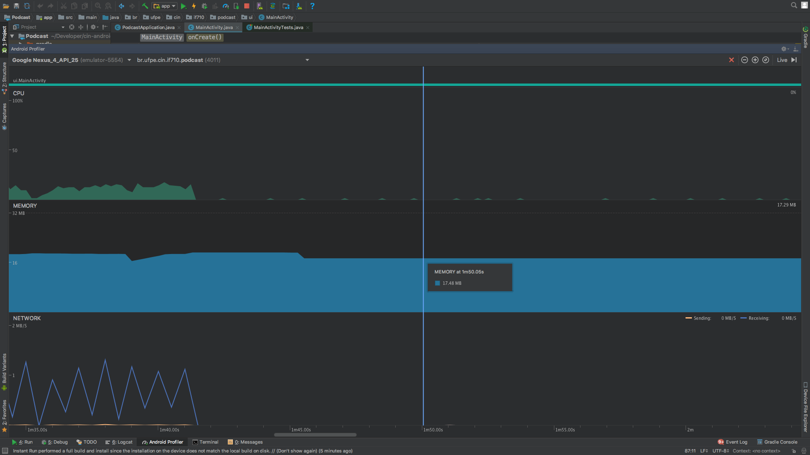

# CPU & Performance

Para os testes foram utilizadas as ferramentas **AndroidProfiler**, **TraceView** e **AndroidDevMetrics**

Uma das primeiras alterações no código foi trocar os diversos inserts no banco por uma inserção em batch. Colocamos uma flag no método de inserir que permite escolher entre bulkInsert e um loop com vários inserts.

* Como primeiro teste, utilizamos o AndroidProfiler para verificar de forma grosseira a diferença entre ambos

* BulkInsert

* Loop com vários inserts

* Como podemos ver, aparentemente o bulkInsert exige mais do processador, porém durante menos tempo. Este teste no entanto, não é tão preciso pois durante esse mesmo intervalo de tempo há um serviço de download do feed sendo executado.

Aqui está o códgido (note a flag *bulkInsert*):

Outra alternativa que tentamos foi usar um método startMethodTracing() para medir a diferença entre o tempo de execução dos inserts e do bulkInsert. No entanto, esta alternativa se mostrou falha, pois o método em questão só consegue rastrear os métodos do sistema. Como o bulkInsert pertence à biblioteca do Android, o startMethodTracing() aferiu sua execução corretamente, corroborando com o tempo medido pelo AndroidProfiler. No entanto, apesar de termos isolado ao máximo o loop dos inserts individuais, o máximo que conseguimos foi o tempo de um único insert, e que claramente não condizia com a realidade, pois ao debugar o código percebemos que os 311 podcasts são inseridos com tempo um pouco maior do que o bulk insert, mas não tanto assim. Provavelmente se tivessemos milhares de registos essa diferença seria mais notória.

Para visualizar o a saída do tracing usamos o TraceView:

* BulkInsert

* Um insert isolado

Por último, utilizamos o AndroidDevMetrics para medir o tempo dos métodos do ciclo de vida das duas activities do nosso app.
Na MainActivity não foi constatado nenhuma perda de frame, enquanto o EpisodeDetailsActivity acabou perdendo uma quantidade pequena

*obs: tentamos ativar a opção de methodTracing do AndroidDevMetrics, mas essa funcionalidade requer um dispositivo real e só tivemos acesso a um emulador (usuário iOS =/ )*

Por último, destacamos com o profiler a funcionalidade de baixar um podcast da rede. Detalharemos mais no arqvuivo *bandwidth.md*

