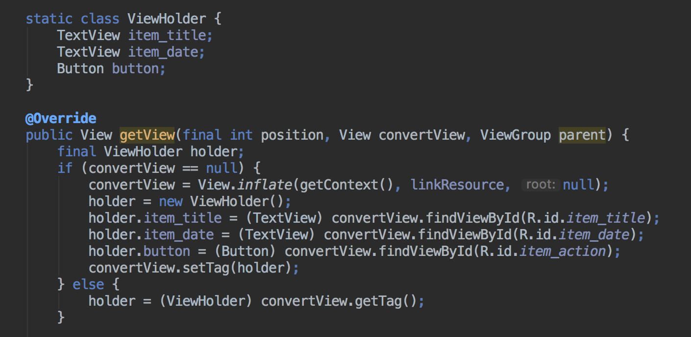
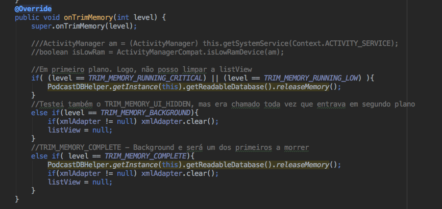

# Memória

Para mensurar o consumo de memória utilizamos as ferramentas **AndroidProfiler** **AndroidDevMetrics** e **LeakCanary**. Além das ferramentas, tomamos algumas medidadas para garantir uma redução no consumo e o controle de quais recursos devem ser liberados em caso de pouca memória. Detalharemos tais medidas mais abaiso.

Primeiramente, gostaríamos de destacar que configuramos o LeakCanary de acordo com a documentação oficial, mas não conseguimos detectar nenhum vazamento. No entanto, ao comentar um dos *unregisterReceiver()*, o próprio AndroidStudio nos alerta para tal vazamento:

- Como uma primeira medida para consumir menos memória, criamos um ViewHolder no adapter na ListView do feed, para reaproveitar as views que já estavam sendo exibidas na tela:

- Além disto, para o caso de o sistema precisar liberar algum recurso do nosso app, utilizamos o método *onTrimMemory()* para ter um certo controle sobre os recursos a serem liberados. Como casos mais gerais, o app pode estar em primeiro plano (visível para o usuário) ou rodando em background.

- Para o primeiro caso, consideramos uma situação:
Caso esteja com pouca memória, libere toda a memória associada ao banco de dados (*releaseMemory()*)

Já quando o app estiver em background, seu processo entra para a lista LRU (least recently used). Quanto mais próximo do início desta lista ele estiver, mais provável que ele seja liberado da memória. Escolhemos tratar dois especificamente:

- O app está com pouca memória, mas ainda não de forma crítica (*TRIM_MEMORY_BACKGROUND*):
Ação: limpa a ListView e seu adapter

- O app está com muito pouca memória e no topo da LRU (*TRIM_MEMORY_COMPLETE*): 
Ação: limpa a ListView, seu adapter e libera o cache do banco de dados (*releaseMemory()*)

Segue abaixo o techo de código:

Por último, utilizamos também o AndroidProfiler, cujas imagens podem ser vistas nos doc *bandwitdh.md*
Ações como o bulkInsert, além de inserir no banco uma vez por sessão e baixar o feed de forma esporádica também ajudam a consumir menos memória
