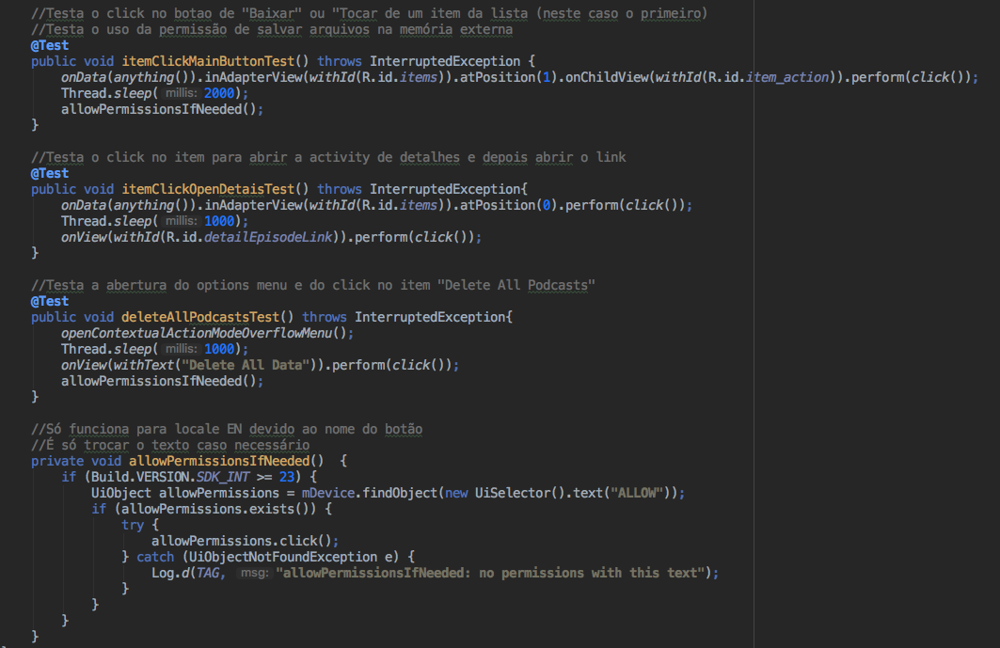

# Testes

Para os testes foram utilizados as ferramentas **Espresso** e **UIAutomator**

Entre os testes com o **Espresso** estão:

- Click no item da lista para abrir a ação principal, isto é, baixar ou tocar o podcast
- Click no item da lista para abrir a tela de detalhes
  -Click no link do podcast, na tela de detalhes, para abrir o browser
- Click no options menu para depois clicar em "Delete All Podcasts"

Particularmente nos clicks de baixar e deletar os podcasts foi preciso clicar no botão "Allow" no dialog que solicita a permissão para escrever no armazenamento externo. No entanto, o Espresso não é capaz de interagir com componentes do sistema. Por isso foi necessário usar o **UIAutomator**.

*obs: O click no botão de aceite do dialog só funcionará se o Android estiver configurado para o idioma inglês, dado a uma comparação com a string "Allow". É só mudar o texto no código*.

Todos os testes foram bem sucedidos após alguns ajustes, entre eles, acrescentar um leve delay no @Before, para esperar a lista ser baixada, e descobrir como tocar no "Allow" do dialog do sistema.

Segue abaixo um trecho do código:

